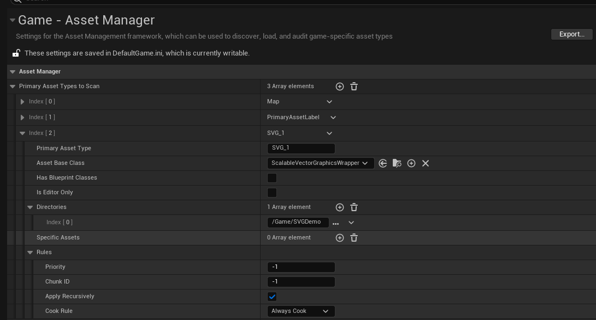
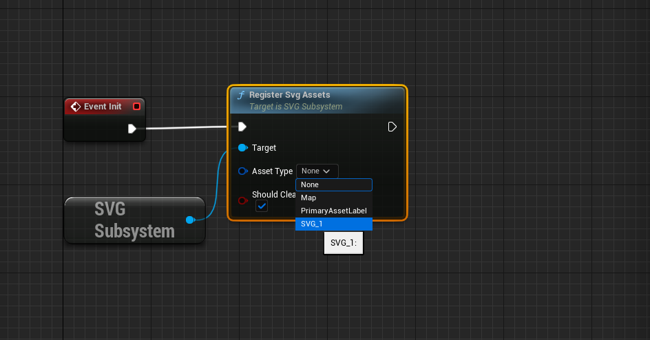
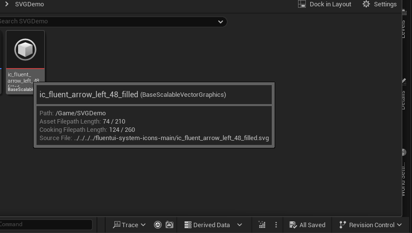
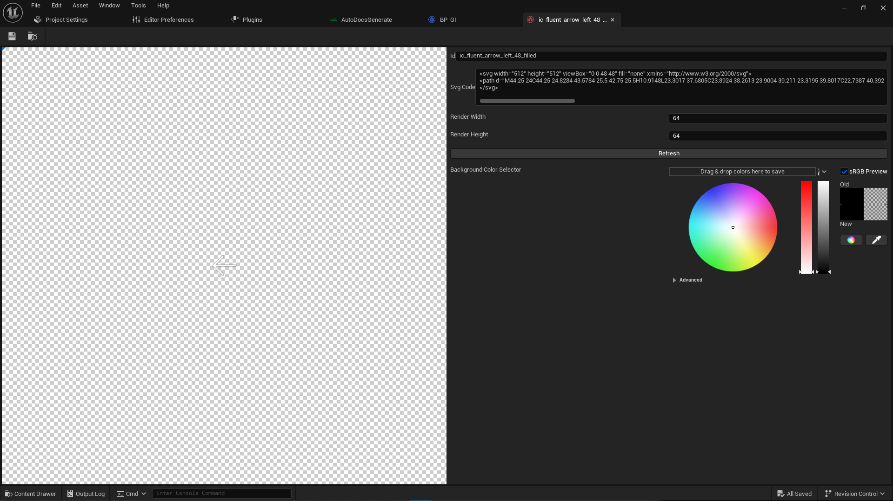
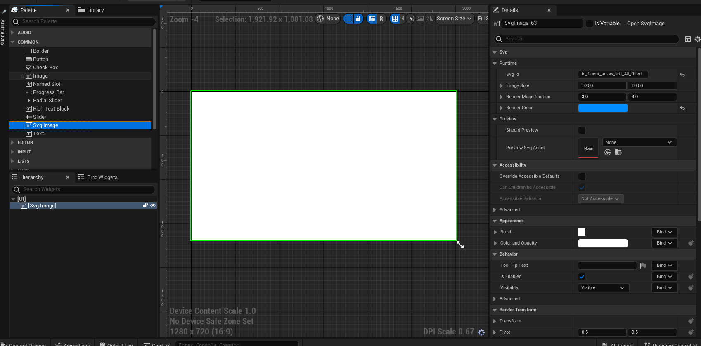
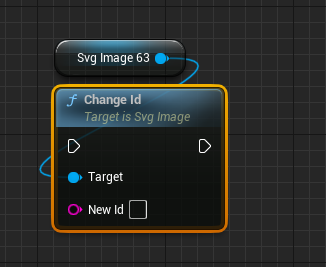

# Runtime SVG System
[plugin url]: https://fab.com/s/e8bcd1574794	"fab"
## Media

[How to use SVG Editor ](https://drive.google.com/file/d/1y6lvNUPU7P22epUUNsLHbLHe7OydS3if/view?usp=sharing)

[How to use SVG Runtime](https://drive.google.com/file/d/1Pa4p8kAjKSwEVDJ2KkiorEjMDuzvutc4/view?usp=sharing)

## Tutorial

1. Create Primary Asset Types(Directory is your SVG asset Dir,Base Class must be ScalableVectorGraphicsWrapper):
2. Register assets with the system using the RegisterSvgAssets function (Choose your asset type):
3. Directly drag the svg file into the directory just now
4. Double-click to enter the asset editor
5. By default, the ID of the SVG asset is the file name. It is recommended to replace the "-" of the svg file with "_". If you understand the content of the SVG asset, you can modify the SVG file directly here. Note that the rendering size and background color will only change the preview.
6. In the widget, use SVG Image to display your icon. The settings in the Preview column can facilitate debugging. The information in Runtime is the settings used when the game is actually running. When the Render Color is the default transparent color, the system will use SVG The color set in the file.
7. you can change svg image id at runtime

