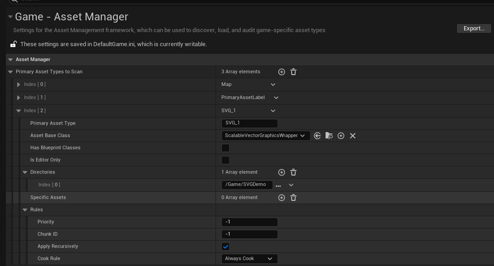
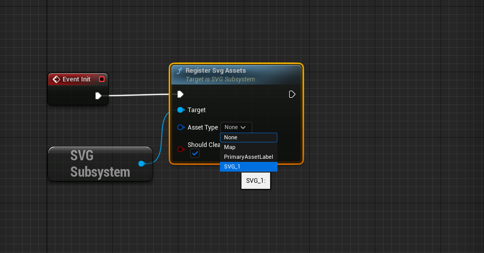
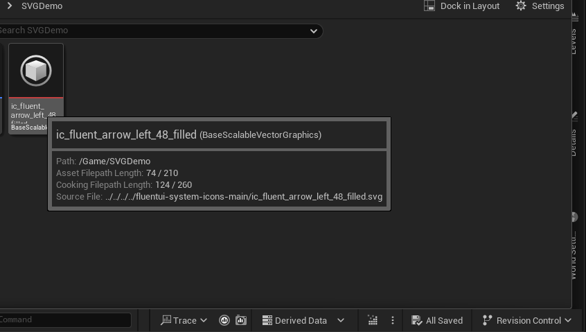
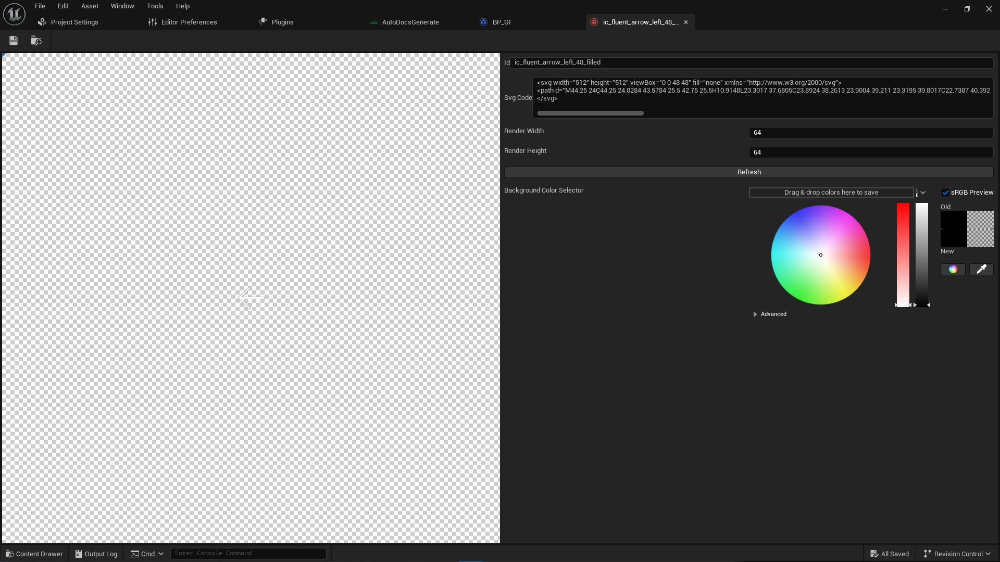
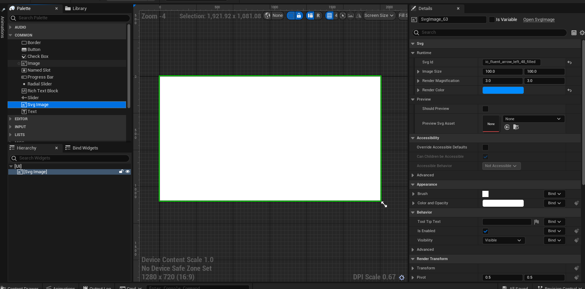
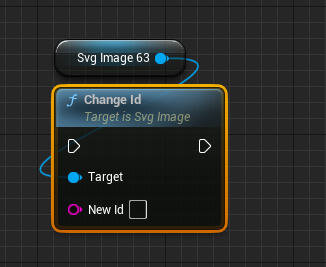

# Runtime SVG System

[Download plugin(fab)](https://fab.com/s/e8bcd1574794)

## Media

[How to use SVG Editor ](https://drive.google.com/file/d/1y6lvNUPU7P22epUUNsLHbLHe7OydS3if/view?usp=sharing)

[How to use SVG Runtime](https://drive.google.com/file/d/1Pa4p8kAjKSwEVDJ2KkiorEjMDuzvutc4/view?usp=sharing)

## Note
1. If ShouldCleanUpOnLoadMap is checked, the system will release loaded assets when switching levels
2. RenderMagnification means: if RenderSize is 60 and RenderMagnification is 3, then the actual texture size is 60*3=180
3. Options with the Preview keyword will not affect anything running, they are only useful for previewing.
4. Now we don't need to create so-called AssetTypes anymore. Just check the AutoRegister option, and the system will automatically register it. The principle is that it is obtained through AssetManager, which means that whether in the Editor or in a packaged environment, it must be ensured to be in the Asset Registry cache.

## Tutorial
### Base Class has been renamed to SvgWrapper！！！
1. Create Primary Asset Types(Directory is your SVG asset Dir,Base Class must be SvgWrapper):
2. Register assets with the system using the RegisterSvgAssets function (Choose your asset type):
3. Directly drag the svg file into the directory just now
4. Double-click to enter the asset editor
5. By default, the ID of the SVG asset is the file name. It is recommended to replace the "-" of the svg file with "_". If you understand the content of the SVG asset, you can modify the SVG file directly here. Note that the rendering size and background color will only change the preview.
6. In the widget, use SVG Image to display your icon. The settings in the Preview column can facilitate debugging. The information in Runtime is the settings used when the game is actually running. When the Render Color is the default transparent color, the system will use SVG The color set in the file.
7. you can change svg image id at runtime

